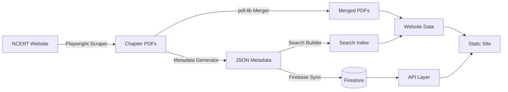

# NCERT Library

[](https://github.com/chirag127/ncert-library/actions/workflows/ci.yml)
[](https://github.com/chirag127/ncert-library/actions/workflows/daily-scrape.yml)
[](LICENSE)
[](https://codecov.io/gh/chirag127/ncert-library)

> A world-class, open-source digital library for NCERT textbooks. Zero cost. Fully automated.

## Features

- **Complete Collection** — All NCERT textbooks from Balvatika to Class XII
- **Fast Search** — Full-text search with typo tolerance and fuzzy matching
- **Beautiful UI** — Modern, responsive, mobile-first design with dark mode
- **PWA** — Installable, offline-capable progressive web app
- **PDF Downloads** — Download complete merged textbooks or individual chapters
- **Metadata** — Rich metadata, keywords, chapter links, and more
- **Keyboard Shortcuts** — Power-user friendly with global command palette
- **Export** — JSON, CSV, YAML, Markdown, XML, OPDS formats
- **Automated** — Daily GitHub Actions scrape and update pipeline
- **Zero Cost** — Static site, no backend servers, no recurring costs

## Tech Stack

| Layer | Technology |
|-------|-----------|
| Monorepo | Turborepo + pnpm |
| Language | TypeScript (strict) |
| Website | Astro + React islands |
| Styling | Tailwind CSS v4 + shadcn/ui |
| Search | FlexSearch (prebuilt indexes) |
| Scraping | Playwright + Cheerio |
| PDF | pdf-lib + PyPDF2 |
| Database | Firebase Firestore (metadata) |
| CI/CD | GitHub Actions |
| Linting | Biome |
| Testing | Vitest + Playwright |
| Releases | Changesets |

## Project Structure

```
ncert-library/
├── apps/
│   ├── website/          # Astro website
│   └── docs/             # Documentation site
├── packages/
│   ├── types/            # Shared TypeScript types
│   ├── scraper/          # NCERT textbook scraper
│   ├── metadata/         # Metadata generation & Firebase sync
│   ├── pdf-merger/       # Chapter PDF merging
│   ├── search-index/     # Prebuilt search indexes
│   ├── shared/           # Shared utilities
│   └── api-client/       # Client-side API client
├── tools/
│   ├── scripts/          # CI/CD automation scripts
│   └── python/           # Python PDF utilities
├── .github/workflows/    # GitHub Actions
└── data/                 # Generated data (gitignored PDFs)
```

## Getting Started

### Prerequisites

- Node.js >= 22
- pnpm >= 10

### Install

```bash
git clone https://github.com/chirag127/ncert-library.git
cd ncert-library
pnpm install
```

### Build

```bash
pnpm build
```

### Run development server

```bash
pnpm dev
```

The website will be available at `http://localhost:4321`.

### Run tests

```bash
pnpm test              # Unit tests
pnpm test:e2e          # E2E tests (requires website running)
pnpm lint              # Linting with Biome
pnpm typecheck         # TypeScript checks
```

## Data Pipeline



## Architecture

```
┌─────────────────────────────────────────────────────────┐
│                   GitHub Actions                        │
│  ┌────────┐  ┌──────┐  ┌─────────┐  ┌──────────────┐  │
│  │Scraper │→│ PDF  │→│Metadata │→│Search Index  │  │
│  │        │  │Merger│  │Generator│  │Builder       │  │
│  └────────┘  └──────┘  └─────────┘  └──────────────┘  │
└─────────────────────────────────────────────────────────┘
         │          │           │              │
         ▼          ▼           ▼              ▼
    ┌────────┐ ┌────────┐ ┌──────────┐ ┌──────────────┐
    │Chapter │ │Merged  │ │Metadata  │ │Search Index  │
    │ PDFs   │ │ PDFs   │ │ JSON     │ │ JSON         │
    └────────┘ └────────┘ └──────────┘ └──────────────┘
         │          │           │              │
         └──────────┴───────────┴──────────────┘
                              │
                              ▼
                   ┌──────────────────┐
                   │   Astro Static   │
                   │   Site (PWA)     │
                   └──────────────────┘
                              │
                    ┌─────────┴─────────┐
                    ▼                   ▼
             ┌──────────┐       ┌──────────────┐
             │Firebase  │       │ GitHub Pages │
             │Firestore │       │   (CDN)      │
             └──────────┘       └──────────────┘
```

## API

All data is available as static JSON files:

- `/data/metadata/books.json` — Complete book list
- `/data/metadata/classes/{class}.json` — Books by class
- `/data/metadata/subjects/{subject}.json` — Books by subject
- `/data/metadata/languages/{language}.json` — Books by language
- `/data/metadata/bookcodes/{code}.json` — Individual book metadata
- `/data/search-index/documents.json` — Search documents
- `/data/search-index/suggestions.json` — Search suggestions

## License

MIT — see [LICENSE](LICENSE)

## Contributing

See [CONTRIBUTING.md](CONTRIBUTING.md)

## Acknowledgments

- NCERT for the educational content
- All open-source libraries that made this possible
